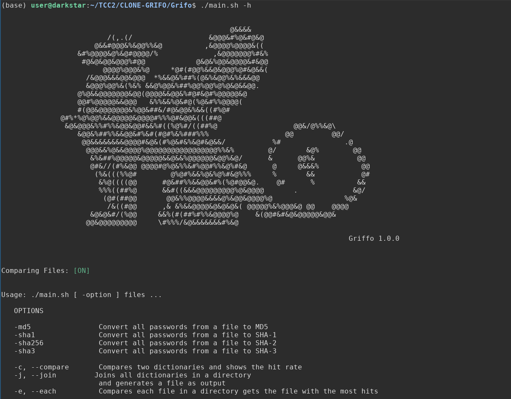

## GRIFO: Comparing password files


This is a simple script that was created to perform comparisons between password dictionaries generated from the project  [Passwords-Cracker](https://github.com/MarlonBrendonx/Passwords-Cracker)


* Functionalities




### Metric

Hit Ratio
$$
HR = \frac{ |U^l_{hits}| } { |U_{all}| }
$$

* Numerator |𝑈 ^𝑙 ℎ𝑖𝑡𝑠| represents the number of correct passwords generated compared to dictionary

*  |𝑈𝑎𝑙𝑙| Represents the total number of passwords in the compared dictionary


* Hash passwords from a dictionary. The password file are saved in tmp

  ```bash
  ./main.sh -md5 passwords.txt
  ```

  

* Compares two dictionaries and shows the Hit Rate (HR)

  ```bash
  ./main.sh -c passwds-gen test.txt
  ```

  

* Merge multiple dictionaries into one

  ```bash
  ./main.sh -j passwds/
  ```

  

* Compare each dictionary in a directory and get the dictionaries that had the highest Hit Ratio

  ```bash
  ./main.sh -e passwds/ test.txt
  ```

  